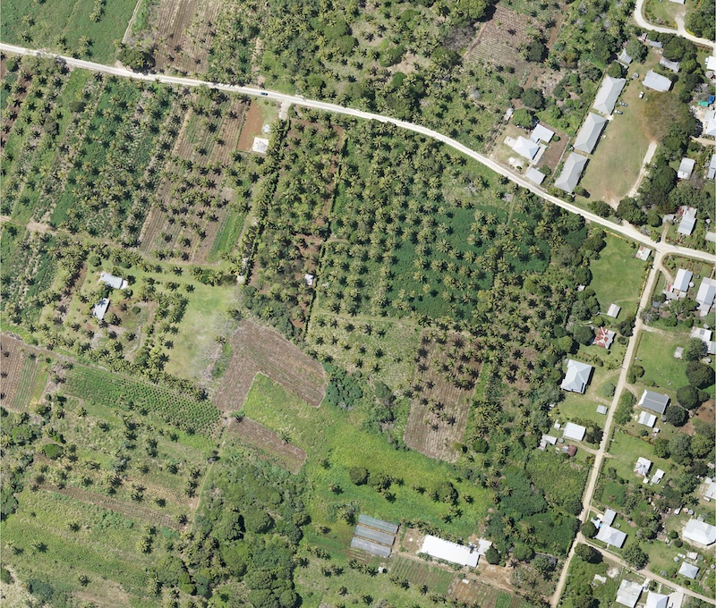
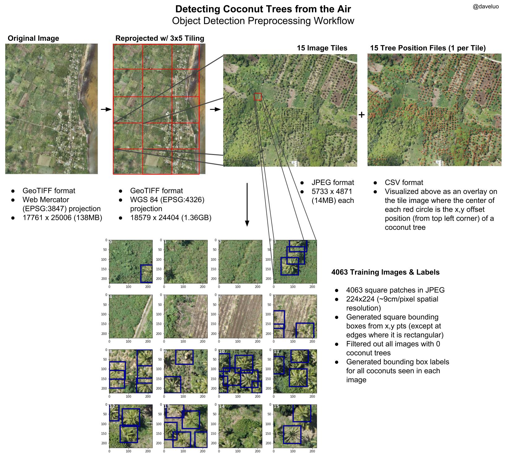

# Detecting Coconut Trees from the Air in the South Pacific (Tonga)

## Motivation & Sources

- https://werobotics.org/blog/2018/01/10/open-ai-challenge/
- https://docs.google.com/document/d/16kKik2clGutKejU8uqZevNY6JALf4aVk2ELxLeR-msQ/edit

> In collaboration with WeRobotics and OpenAerialMap, the World Bank’s UAVs for Disaster Resilience Program captured ~80km2 of high resolution (under 10 cm) aerial imagery in the Kingdom of Tonga in October 2017. The World Bank now seek qualified teams to develop machine learning classifiers to automate the analysis of this imagery. The classifiers will also be applied to new imagery to speed up baseline analysis and damage assessments in the future. 

> Being able to quantify the number of trees that serve as an important source of livelihood  for local communities is essential. These trees and their locations can then be compared before and after major disasters to better understand just how much local agriculture and hence food security has been affected. This can directly inform and accelerate subsequent relief efforts. The focus on roads is also meant to help identify the impact of natural disasters on local transportation infrastructure and to inform how best to distribute aid across affected areas.

- original GeoTIFF file: https://map.openaerialmap.org/#/-175.34310311079025,-21.097543257642922,18/square/20002233030/5a28640ebac48e5b1c58a81d?_k=a2zw5d
- original annotations file: https://drive.google.com/file/d/1rumWHzO3_CO40uXhaP69roUyfFzYCe20

> Note: The aerial imagery provided for this challenge is under a CC-BY creative commons license. The OSM training data (roads, building, trees, ets) is provided under the Open Data Commons Open Database License (ODbL).

## 4 tree types annotated as lon/lat point coordinates:
- coconut: Cocos nucifera **<-- In these notebooks, we are focused on detecting coconut trees only (single class)**
- mango: Mangifera indica
- banana: Musaceae, Musa
- papaya: Carica papaya
- other points annotated: population centers, power poles, manmand barriers and misc. fixtures

## Pre-processing overview:

## Notebooks summary:
### 1. "coconuts-tilegen":
- Reproject original GeoTIFF to WGS 84 
- Create tiles and convert lat, lon to x,y display offset coordinates for all trees within each tile (15 tiles)

### 2. "coconuts-imagegen":
- Generate 224px x 224px patches for each tile.
- Convert x,y offsets for each tree point into square bbox coordinates (or rectangles at the borders)
- Filter out patches that do not contain any trees
- Save remaining patches as jpeg images with corresponding bbox and category labels (4062 jpg files)

### 3. "coconuts-model":
- Load jpegs and bbox/cat labels into model notebook and train away!